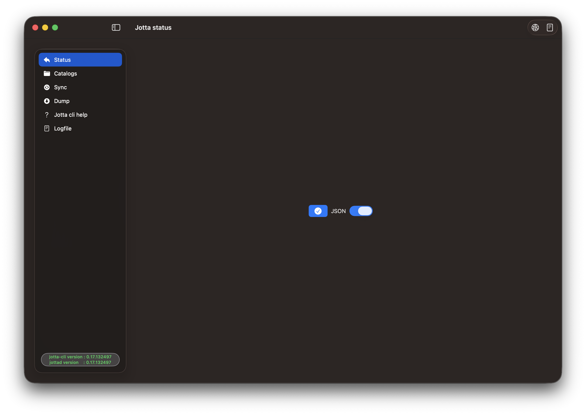
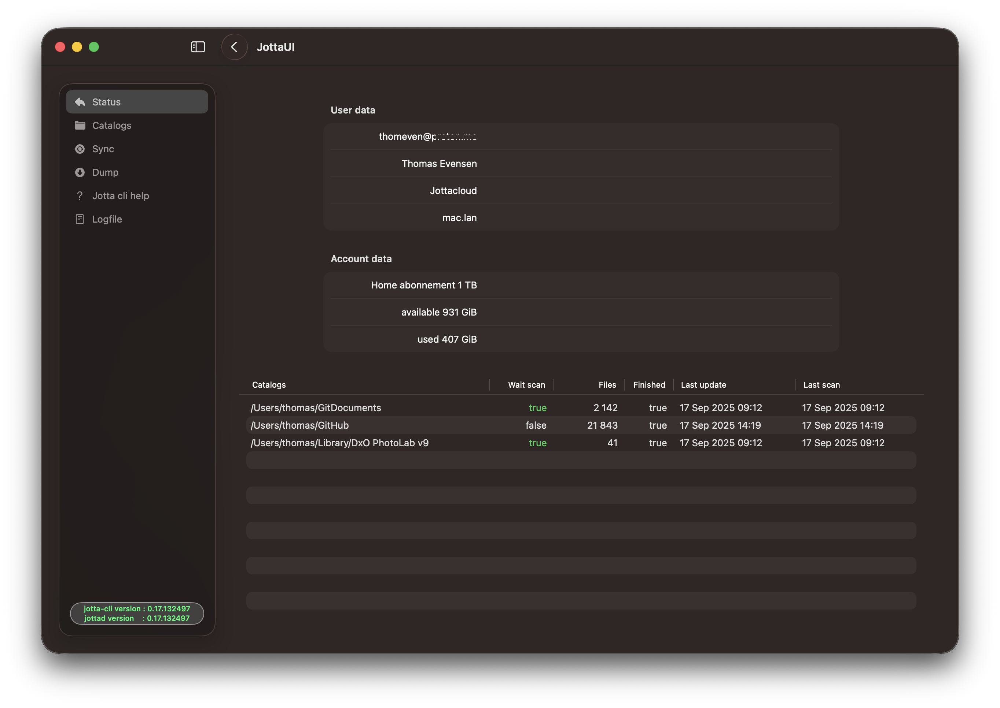
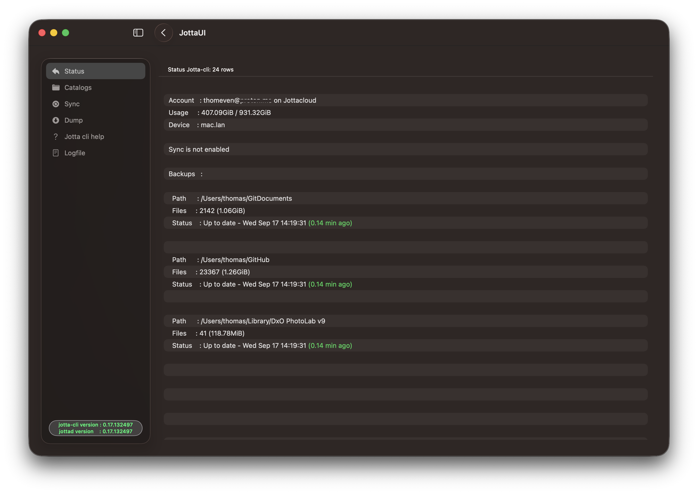
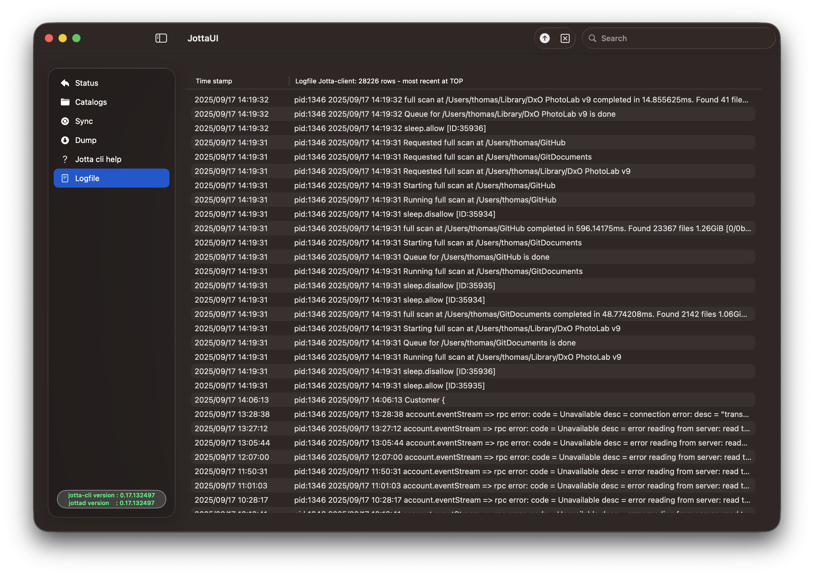
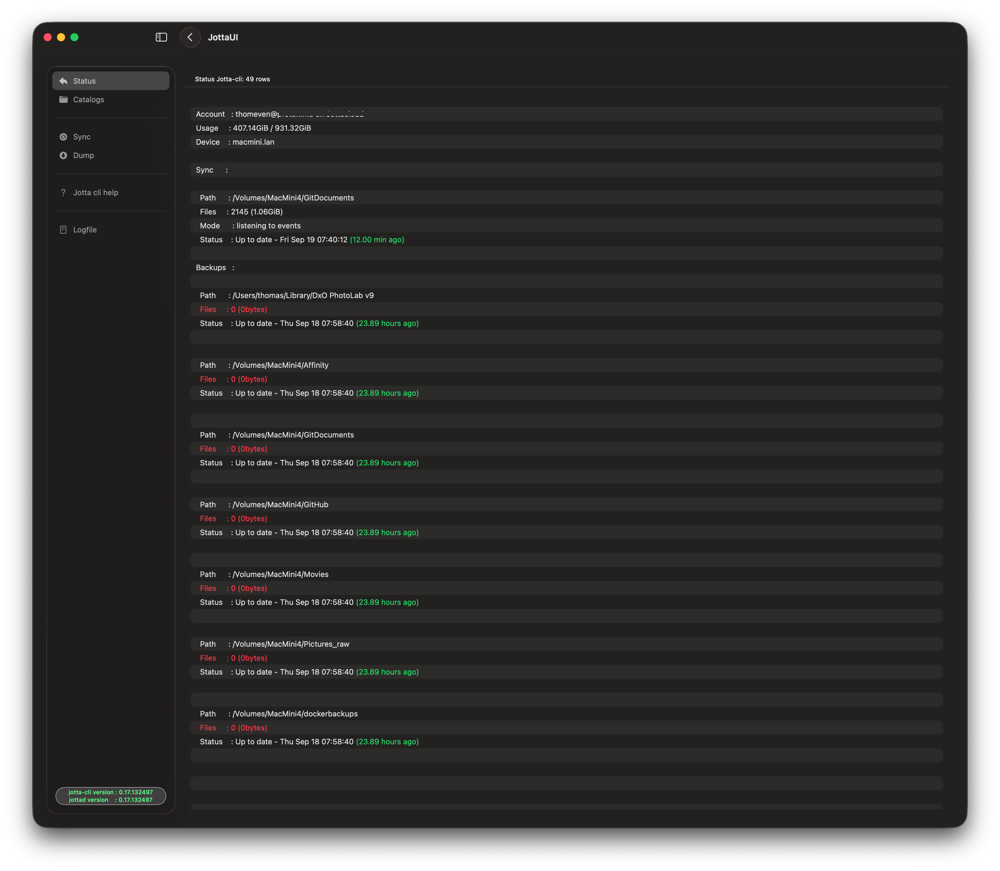
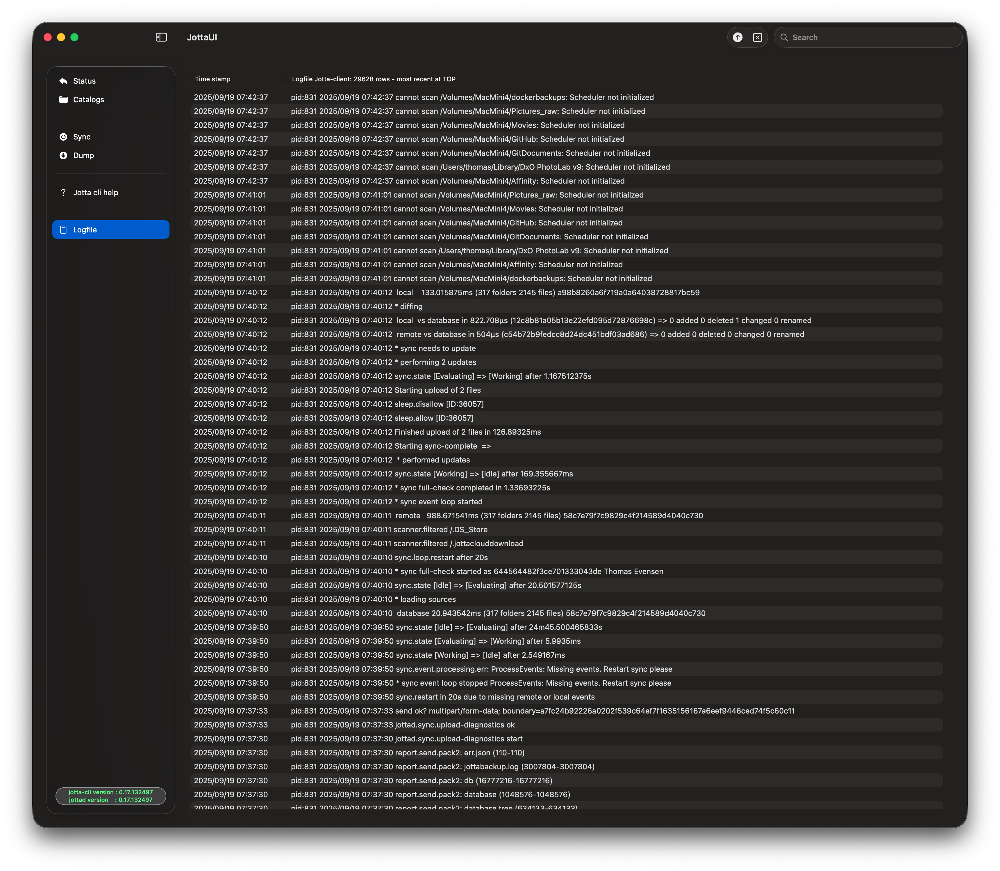
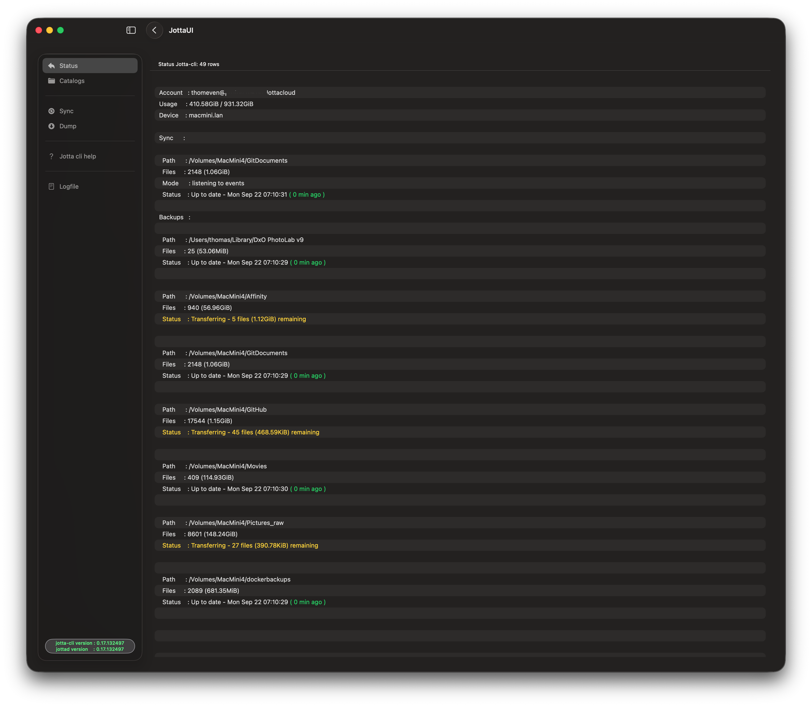

## Hi there 👋

Version 0.1.0 of JottaUI require Xcode 26 and Swift 6.2 to compile.  Before using the alpha version, login on Jottacloud by using the jotta-cli in a terminal window. 

JottaUI is digitally signed and notarized by Apple, ensuring its security and preventing malicious code and tampering

This is the repository for JottaUI, a SwiftUI based macOS application ontop of Jottacloud`s jotta-cli command line client. JottaUI is released for *macOS Sequoia and later* on *Mac Silicon* and *Intel* based macs.  The JottaUI uses [SwiftyJSON](https://github.com/SwiftyJSON/SwiftyJSON) for parsing JSON output from the jotta-cli. The JottaUI is for the moment only a test.

The jotta-cli command is installed by Homebrew, please refer to Jottacloud´s documentation for installing jotta-cli. The JottaUI picks up the correct path for the jotta-cli.

Sometimes the jotta daemon fails to login. I have reported the issue to JottaCloud, but no fix yet. The workaround for me is to log out and log in again. The JottaUI does mark lines with red if there are some errors.

